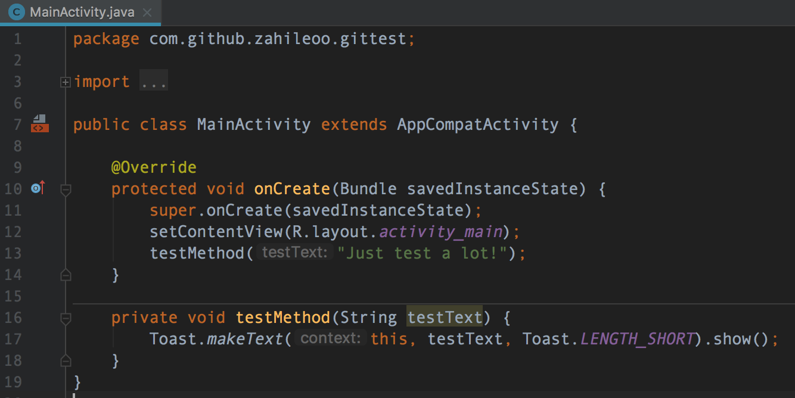
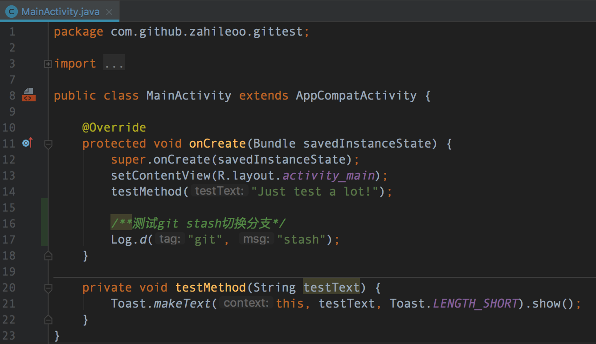
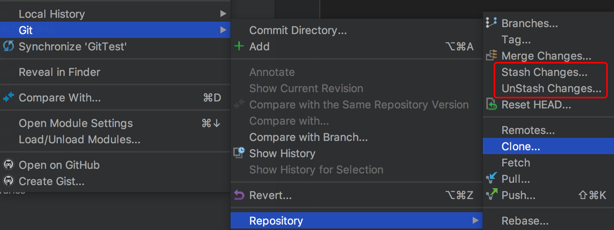

# 使用Git stash切换分支

[摘自此处](https://blog.csdn.net/qq_32452623/article/details/76100140)

### 场景描述：

```
当你正在dev_666分支，非常聚精会神地实现一个功能666模块，简直键盘如飞的编写代码~~
然后这时，客户反馈一个bug，非常严重，必须立马解决，优先级为0！！！
于是，你需要checkout到release分支去工作，但是666功能还没有完成怎么办？
此时有两个选择：
	1. 提交dev_666分支代码，然后切换，但是会产生一个无意义的提交
	2. 不提交直接切换，然而这个选项根本没人选择
```

是不是很难，这时你就要考虑用第三种方式：

#### git stash
将当前修改（未提交的代码）存入缓存区，切换分支修改bug，回来之后再通过`git stash pop`取出来。


#### 使用实例
当前工程有`master`和`dev`两个分支。

`master`分支代码：


`dev`分支代码：


现需要`checkout`到`master`分支，做bug修复。在`dev`分支使用`git stash`将现有分支更改暂存到缓存区，而不用做`commit`操作，然后切换`master`分支。

> 注：IntelliJ IDEA的编辑器有Git图形化操作界面，可以直接直接操作处理。如下图



#### 操作步骤
 1. `dev`分支使用`git stash`暂存当前更改到缓存区（此时dev分支代码为修改之前最后一次提交代码位置）
 2. `checkout`置`master`分支，修改线上bug
 3. `checkout`置`dev`分支，使用`git stash pop`恢复之前未提交的修改内容

 
