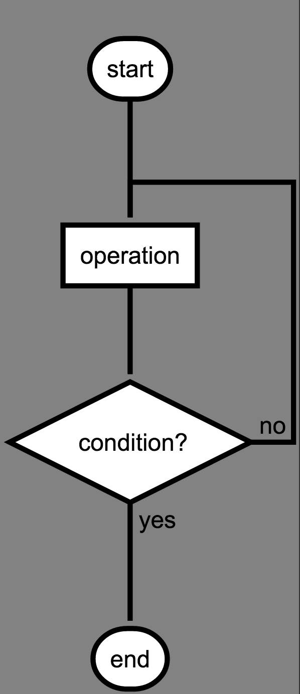
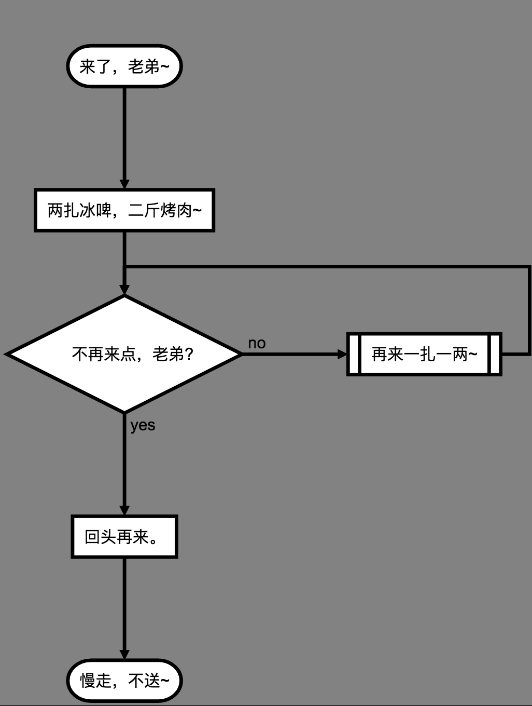

# Flowchart基础语法
## 元素定义
一个流程图的基本元素有六大类别：

 1. `start`：流程图开始
 2. `end`：流程图结束
 3. `operation`：操作
 4. `subroutine`：子进程
 5. `condition`：判断条件
 6. `inputoutput`：输入输出

元素本分的基本代码结构：（基本语法）
```
tag=>type: content:>url
```
其中：

 1. `tag`：就是作为第二部分连接元素时引用我们定义元素时的名称，这个`tag`需要唯一
 2. `type`：就是我们流程图的6大基本元素类别，选择元素种类填入即可
 3. `content`：流程图元素中所显示的文字，此处`:`与文本直接必须要空格隔开
 4. `url`：元素所带有的超链接。

## 元素连接
将第一部分定义的元素通过我们想要的方式进行连接。利用`->`来连接定义的元素，元素利用`tag`
来区分。

 1. 对于每一个「判断条件元素」`condition`，都有`yes`和`no`两个分支；
 2. 每个元素可以指定分支走向，默认是`向下`的，也可以用`right`指向右边。
 
## 简单示例
```
@flowstart
st=>start: start
op=>operation: operation
cond=>condition: condition?
en=>end: end

st->op->cond
cond(yes)->en
cond(no)->op
@flowend
```


---

